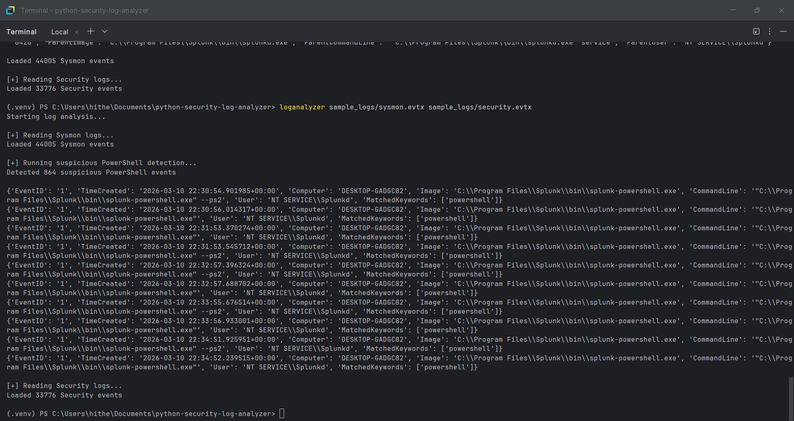
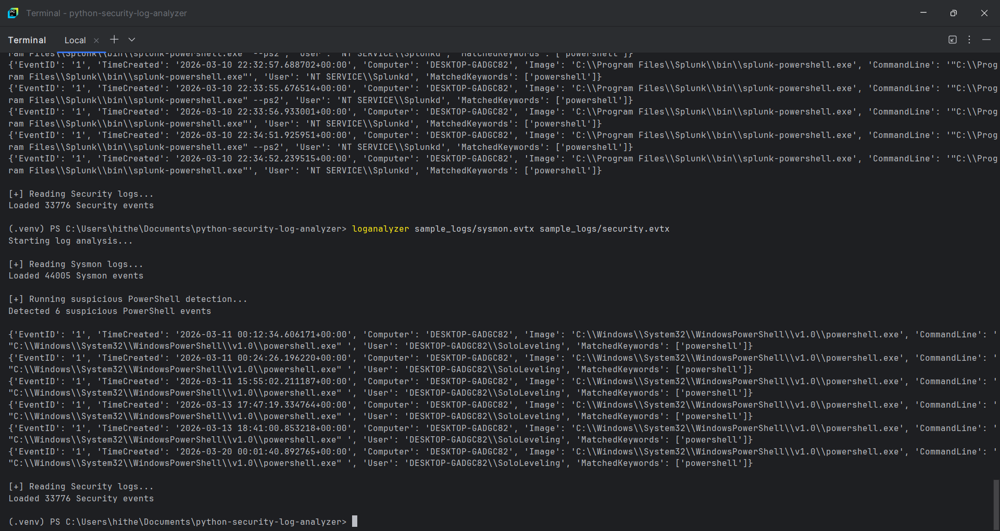
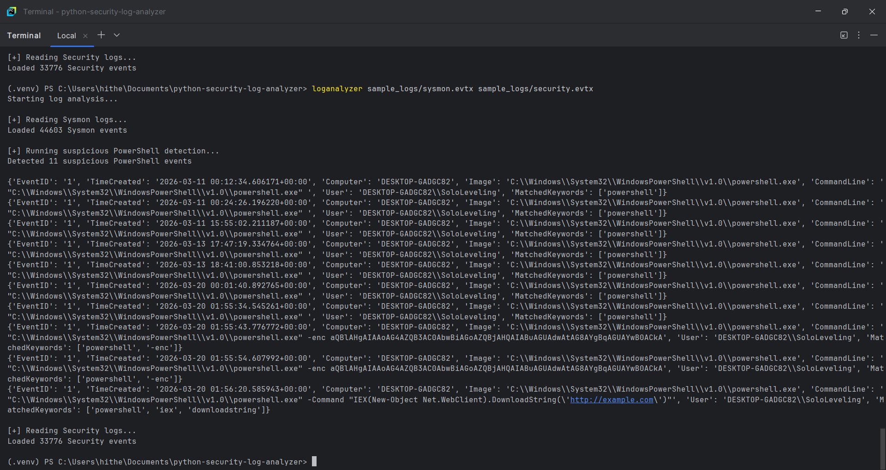
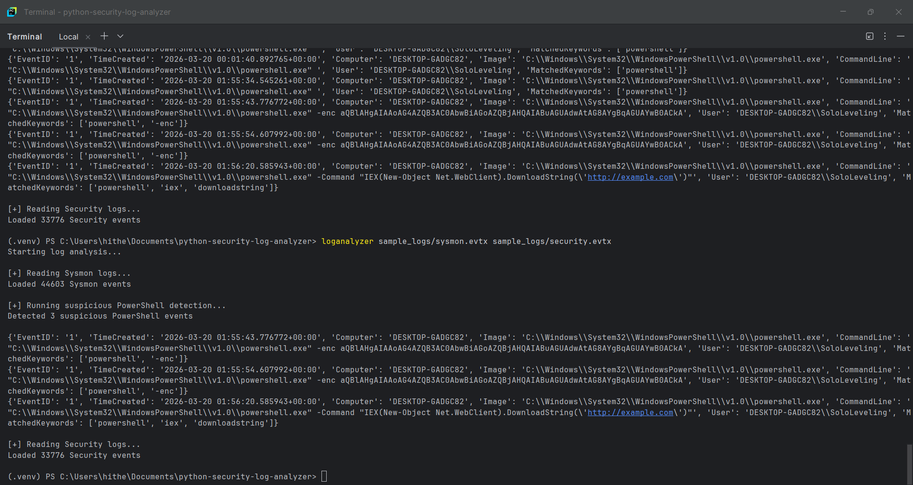

# Detection Engine

## Objective

The detection engine is responsible for identifying suspicious activity within parsed Windows Event Logs.

It operates on structured data generated by the parser pipeline and applies rule-based logic to detect potential indicators of compromise (IOCs), with a primary focus on PowerShell-based attacks.

---

## Detection Strategy

The current implementation focuses on identifying suspicious PowerShell activity using keyword-based detection.

The detection logic inspects the following fields:

- Image
- CommandLine
- User

Key indicators include:

- Encoded commands (`-enc`)
- Script execution (`iex`)
- Remote content download (`DownloadString`)
- PowerShell execution context

---

## Detection Logic

The engine scans each parsed event and checks for the presence of suspicious keywords.

Keywords used:

- powershell
- -enc
- iex
- downloadstring

If any of these keywords are present in the command line or process image, the event is flagged as suspicious.

---

## Example Detection Output

```python
{
    "EventID": "1",
    "TimeCreated": "...",
    "Computer": "...",
    "Image": "powershell.exe",
    "CommandLine": "...",
    "User": "...",
    "MatchedKeywords": ["powershell", "-enc"]
}

```

## Evidence


### Initial noisy PowerShell detection




### Tuned detection with reduced false positives




### Suspicious PowerShell execution in FLARE VM




### True positive detection output



## Detection Coverage

The current detection engine is capable of identifying:

- Base64 encoded PowerShell commands
- Script execution using Invoke-Expression (IEX)
- Remote payload retrieval using `.DownloadString()`
- General PowerShell abuse patterns

## Limitations

- Keyword-based detection may generate false positives
- Does not decode Base64 payloads
- No multi-event correlation
- No alert prioritization

## Future Improvements

- Base64 decoding of payloads
- Rule modularization (Sigma-style)
- Event correlation across logs
- Alert scoring and prioritization
- Export results to structured formats (JSON/CSV)

## Summary

The detection engine successfully identifies suspicious PowerShell activity using rule-based analysis on parsed EVTX logs.

It demonstrates core detection engineering capability aligned with SOC workflows.

---

## Brute-Force Authentication Detection

### Objective

Detect repeated failed authentication attempts in Windows Security logs that may indicate brute-force activity against user accounts.

---

### Data Source

- **Log Source:** Windows Security Event Log  
- **Event ID:** 4625  
- **Description:** An account failed to log on  

---

### Detection Strategy

The detection logic processes parsed Security EVTX events and filters for **Event ID 4625**.

Failed logon attempts are grouped based on:

- `TargetUserName`
- `IpAddress`

A brute-force alert is triggered when multiple failures are observed for the same user and source.

---

### Detection Logic

1. Parse Security EVTX events  
2. Filter events where `EventID == 4625`  
3. Group events by `(TargetUserName, IpAddress)`  
4. Count failed logon attempts per group  
5. Flag groups where failure count ≥ 5  

---

### Threshold

- **Threshold:** 5 failed logon attempts  

This threshold reduces noise from occasional login errors while capturing repeated authentication abuse.

---

### Key Fields Used

- `EventID`
- `TimeCreated`
- `TargetUserName`
- `IpAddress`
- `LogonType`
- `Status`
- `SubStatus`
- `WorkstationName`

---

### Implementation Notes

The brute-force detection logic is implemented in `detectors.py`:

- `detect_bruteforce_logons(events, threshold=5)`

The CLI pipeline was extended to:

- parse Security logs
- execute brute-force detection
- output structured findings alongside Sysmon detections

---

### Evidence


---

### Detection Coverage

The detection engine is capable of identifying:

- Repeated failed authentication attempts
- Local interactive logon failures (Logon Type 2)
- Network-based authentication attempts (Logon Type 3)
- Brute-force patterns across user accounts

---

### Limitations

- Does not currently enforce time-window constraints  
- Cannot distinguish distributed brute-force attacks  
- Relies on threshold-based logic without behavioral scoring  

---

### Future Improvements

- Introduce time-based correlation (failures within X minutes)  
- Detect distributed brute-force (multiple IPs targeting one user)  
- Correlate with successful logons (Event ID 4624)  
- Add alert severity scoring  

---

### Summary

The brute-force detection extends the detection engine beyond single-event analysis and introduces multi-event correlation based on authentication failures.

It demonstrates practical SOC detection capability using native Windows Security telemetry.

